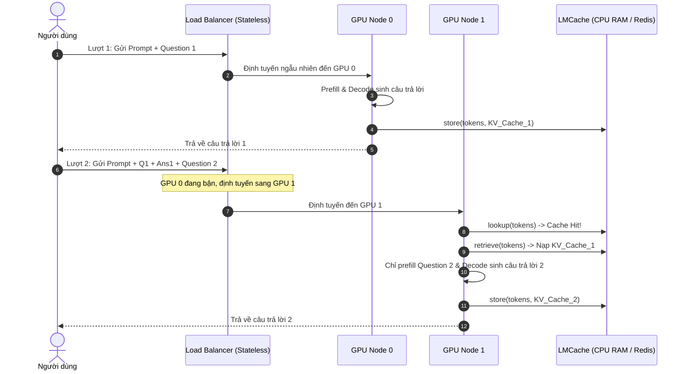

# Case Study 0: Tối ưu hoá Hệ thống Chatbot Hội thoại Nhiều lượt (Multi-round Chatbot)

Hội thoại nhiều lượt (*multi-round conversation*) là một trong những ứng dụng phổ biến nhất của LLM. Tuy nhiên, việc duy trì lịch sử hội thoại dài tạo ra áp lực rất lớn lên hệ thống serving. Case study này sẽ phân tích các điểm nghẽn cổ chai phần cứng và cách LMCache giúp tối ưu hóa hiệu năng hệ thống chatbot.

---

## 1. Sự căng thẳng hệ thống: Sticky Routing vs Load Balancing

Trong một hệ thống chatbot thương mại, hàng ngàn người dùng trò chuyện đồng thời. Tại lượt hội thoại thứ $N$, câu lệnh gửi lên GPU bao gồm:
$$\text{Prompt}_N = \text{System Prompt} + \text{Context} + \text{History}_{1 \to N-1} + \text{Question}_N$$

Khi lịch sử hội thoại phình to lên 8,000 hoặc 16,000 tokens, chi phí tính toán prefill cho phần lịch sử này ở mỗi câu hỏi mới cực kỳ đắt đỏ.

### ⚠️ Điểm nghẽn hệ thống (Tension):
Để tránh tính toán lại, các kỹ sư thường dùng cơ chế **Sticky Routing** (định tuyến cố định) để luôn gửi các câu hỏi của một người dùng về cùng một GPU instance đang chứa *KV Cache* của các lượt trước. Điều này dẫn đến hai vấn đề nghiêm trọng:
1. **Lệch tải (Load Imbalance):** Một số instance bị quá tải do phục vụ nhiều người dùng trò chuyện dài, trong khi các instance khác lại rảnh rỗi.
2. **Khó khăn khi mở rộng (Auto-scaling):** Khi có thêm GPU mới tham gia vào cụm, chúng không thể gánh bớt tải cho các cuộc trò chuyện đang diễn ra vì không có sẵn *KV Cache* lịch sử.

Nếu chuyển sang cơ chế **Load Balancing** thông thường để phân phối đều request, hệ thống bắt buộc phải tính toán lại prefill từ đầu cho toàn bộ lịch sử hội thoại trên GPU mới. Điều này kéo giảm thông lượng (*throughput*) và làm tăng vọt độ trễ phản hồi (*TTFT*).

---

## 2. Mô hình toán học về Tỷ lệ Tiết kiệm Độ trễ

Để đánh giá hiệu quả của LMCache trong việc loại bỏ chi phí tính toán lại lịch sử hội thoại, ta định nghĩa **Tỷ lệ Tiết kiệm Độ trễ (Latency Saving Ratio - $S_{\text{latency}}$)** của pha Prefill:

$$S_{\text{latency}} = \frac{T_{\text{recompute}} - T_{\text{retrieve}}}{T_{\text{recompute}}}$$

Trong đó:
* $T_{\text{recompute}}$: Thời gian GPU thực hiện tính toán lại pha Prefill cho phần lịch sử hội thoại từ lượt 1 đến lượt $N-1$.
* $T_{\text{retrieve}}$: Thời gian LMCache truy xuất và nạp *KV Cache* của lịch sử hội thoại từ CPU RAM hoặc mạng cục bộ vào GPU.

Thay thế các công thức tính toán từ các bài học trước:
* $T_{\text{recompute}} \approx \alpha \cdot L_{\text{seq}}$ (thời gian tính toán tăng tuyến tính theo độ dài chuỗi lịch sử).
* $T_{\text{retrieve}} \approx T_{\text{overhead}} + \beta \cdot L_{\text{seq}}$ (thời gian truyền tải vật lý, với $\beta$ là hệ số truyền tải nhỏ hơn rất nhiều so với hệ số tính toán $\alpha$ của GPU).

Từ đó ta có:

$$S_{\text{latency}} = 1 - \frac{T_{\text{overhead}} + \beta \cdot L_{\text{seq}}}{\alpha \cdot L_{\text{seq}}} = 1 - \frac{\beta}{\alpha} - \frac{T_{\text{overhead}}}{\alpha \cdot L_{\text{seq}}}$$

### 📈 Nhận xét toán học:
Khi chiều dài chuỗi lịch sử hội thoại tiến ra vô cùng ($L_{\text{seq}} \to \infty$):

$$\lim_{L_{\text{seq}} \to \infty} S_{\text{latency}} = 1 - \frac{\beta}{\alpha}$$

Vì tốc độ tính toán lại của GPU ($\alpha$) chậm hơn nhiều so với tốc độ truyền tải bộ nhớ qua PCIe/RDMA ($\beta$), tỷ số $\frac{\beta}{\alpha} \approx 0.05 - 0.1$. Do đó, tỷ lệ tiết kiệm độ trễ $S_{\text{latency}}$ sẽ tiệm cận mức **90% đến 95%** khi lịch sử hội thoại càng dài, giúp giảm TTFT từ vài giây xuống còn vài mili giây.

---

## 3. Sơ đồ định tuyến không trạng thái kết hợp LMCache

Sử dụng LMCache cho phép bộ định tuyến (*Load Balancer*) hoạt động hoàn toàn không trạng thái (*stateless*), tự do phân phối request đến bất kỳ GPU nào trong cụm mà không lo ngại về chi phí prefill:

---

## 4. Liên hệ mã nguồn: Quản lý cây tiền tố hội thoại

Khi chatbot tương tác nhiều lượt, các token lịch sử được nối thêm liên tục. LMCache sử dụng cấu trúc cây tiền tố (*Prefix Tree / Trie*) để nhận diện các đoạn chat trùng khớp.

Trong codebase LMCache, logic so khớp này được thực hiện bởi lớp `SegmentTokenDatabase` định nghĩa tại file [lmcache/v1/token_database.py](file:///Users/admin/TuanDung/repos/LMCache/lmcache/v1/token_database.py). 

Khi engine gọi `LMCacheEngine.lookup()` (tại [lmcache/v1/cache_engine.py](file:///Users/admin/TuanDung/repos/LMCache/lmcache/v1/cache_engine.py)), lớp `SegmentTokenDatabase` sẽ phân tích chuỗi token thành các phân đoạn (*segments*) tương ứng với các khối nhớ và trả về danh sách các khóa dữ liệu đã tồn tại, giúp engine chỉ cần nạp lại các phần lịch sử và chỉ tính toán cho câu hỏi mới.

---

## 5. Checklist cấu hình tối ưu Chatbot serving

* [ ] **Đặt kích thước khối phù hợp (Block Size)**: Định cấu hình kích thước khối tương khớp với vLLM (thường là 16 hoặc 32 tokens) để tối đa hóa khả năng so khớp mã băm tiền tố.
* [ ] **Cấu hình TTL hợp lý (Time-To-Live)**: Đặt thời gian sống cho cache trên CPU RAM và Redis tương ứng với thời gian trung bình của một phiên hội thoại người dùng (ví dụ: 30 phút).
* [ ] **Kích hoạt dọn dẹp Hot Cache**: Bật chế độ `freeze` hoặc tối ưu hóa chính sách `lru` trên tầng CPU RAM để giữ lại các phiên chat đang hoạt động tích cực.
* [ ] **Kiểm tra đồng bộ Tokenizer**: Xác minh các tham số đặc biệt của tokenizer (như `<|endoftext|>`, khoảng trắng thừa) được xử lý đồng bộ giữa các request để không làm lệch mã băm đầu vào.
