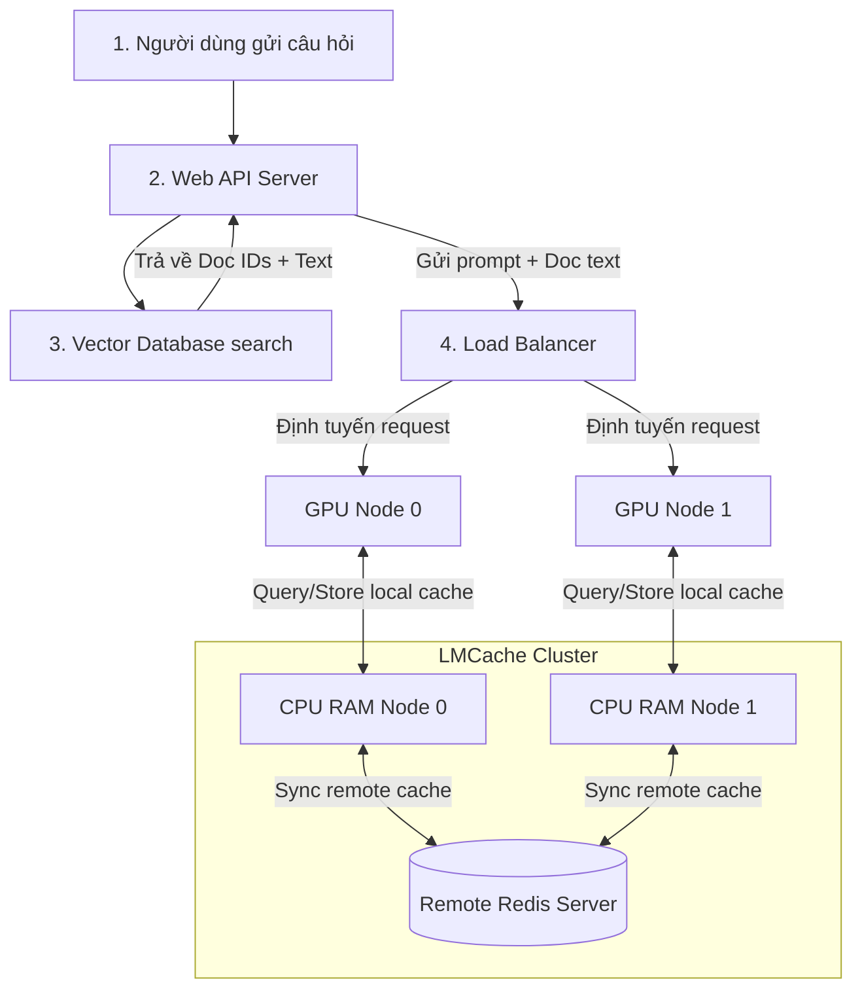

# Case Study 1: Tối ưu hoá Hệ thống RAG doanh nghiệp Quy mô lớn (RAG at Scale)

Hệ thống RAG (*Retrieval-Augmented Generation*) là kiến trúc cốt lõi giúp kết nối LLM với cơ sở tri thức doanh nghiệp. Khi số lượng tài liệu và người dùng đồng thời tăng lên, hệ thống đối mặt với những giới hạn vật lý nghiêm trọng về băng thông bộ nhớ và năng lực prefill của GPU. Case study này phân tích cách LMCache giúp tăng vượt trội thông lượng cụm serving RAG.

---

## 1. Sự căng thẳng hệ thống: Trùng lặp tài liệu truy vấn (Content Contention)

Trong một hệ thống RAG doanh nghiệp điển hình (ví dụ: chatbot tra cứu nội quy nhân sự, pháp lý, tài liệu kỹ thuật):
* Khi người dùng đặt câu hỏi, hệ thống sẽ chạy thuật toán so khớp ngữ nghĩa (*vector search*) để truy xuất ra các phân đoạn tài liệu liên quan (*chunks*).
* Các tài liệu này được nối trực tiếp vào prompt để làm ngữ cảnh phục vụ sinh câu trả lời.
* Hàng trăm người dùng khác nhau có thể hỏi các câu hỏi khác nhau nhưng cùng truy vấn và tham chiếu đến cùng một tài liệu gốc dài (ví dụ: Sách hướng dẫn vận hành dày 100 trang $\approx 40,000$ tokens).

### ⚠️ Điểm nghẽn hệ thống (Tension):
Mỗi khi có request tham chiếu đến tài liệu 40,000 tokens này, GPU phải mất thời gian chạy prefill cực kỳ lâu (trên GPU A100 có thể mất từ 1 đến 2 giây chỉ để prefill ngữ cảnh).
* Nếu hệ thống không lưu trữ cache, toàn bộ cụm GPU sẽ bị nghẽn ở pha Prefill, khiến hàng đợi request bị ùn tắc nghiêm trọng.
* Nếu lưu trên VRAM GPU cục bộ, dung lượng VRAM khổng lồ bị chiếm dụng bởi các tài liệu dài này sẽ khiến GPU không còn chỗ để phục vụ các yêu cầu sinh tiếp theo, dẫn đến OOM hoặc phải giải phóng cache liên tục.

---

## 2. Mô hình toán học về Thông lượng Cụm Serving (Throughput Scaling)

Ta xây dựng mô hình toán học để chứng minh khả năng cải thiện thông lượng (*throughput*) của cụm serving khi tích hợp LMCache.

Giả sử hệ thống xử lý một luồng gồm $N$ yêu cầu truy vấn tài liệu. Thông lượng của cụm hệ thống (số lượng request xử lý thành công trên một đơn vị thời gian) được xác định bằng công thức:

$$\text{Throughput} = \frac{N}{\sum_{i=1}^N \left( \alpha_i T_{\text{retrieve\_i}} + (1 - \alpha_i) T_{\text{prefill\_i}} \right)}$$

Trong đó:
* $N$: Tổng số lượng yêu cầu cần phục vụ.
* $\alpha_i \in [0, 1]$: Biến trạng thái trúng cache của yêu cầu thứ $i$. Nếu trúng cache hoàn toàn (cache hit), $\alpha_i = 1$; ngược lại nếu trượt cache hoàn toàn (cache miss), $\alpha_i = 0$.
* $T_{\text{retrieve\_i}}$: Thời gian LMCache truy xuất và nạp *KV Cache* của tài liệu từ CPU RAM hoặc Redis từ xa vào GPU VRAM.
* $T_{\text{prefill\_i}}$: Thời gian GPU tự tính toán lại pha Prefill cho tài liệu ngữ cảnh đó.

### 📊 Phân tích hiệu năng thông lượng:
* Khi hệ thống không sử dụng LMCache (mọi yêu cầu đều trượt cache, tức là $\alpha_i = 0$ với mọi $i$):
  $$\text{Throughput}_{\text{baseline}} = \frac{N}{\sum_{i=1}^N T_{\text{prefill\_i}}}$$
* Khi sử dụng LMCache với tỷ lệ trúng cache trung bình cụm là $P_{\text{hit}}$:
  $$\text{Throughput}_{\text{LMCache}} \approx \frac{1}{P_{\text{hit}} T_{\text{retrieve}} + (1 - P_{\text{hit}}) T_{\text{prefill}}}$$

Vì $T_{\text{retrieve}}$ (thường từ 50-100 ms qua PCIe/mạng) nhỏ hơn rất nhiều so với $T_{\text{prefill}}$ của tài liệu dài (thường từ 1,000-2,000 ms), khi tỷ lệ trúng cache $P_{\text{hit}} \to 1$ (các tài liệu tài liệu nóng được truy vấn liên tục), thông lượng của cụm serving sẽ **tăng lên gấp 10 đến 20 lần** so với việc tính toán lại từ đầu.

---

## 3. Sơ đồ luồng dữ liệu hệ thống RAG kết hợp LMCache

Quy trình tích hợp LMCache vào hệ thống RAG phân tán đa nút để chia sẻ *KV Cache* của tài liệu:

---

## 4. Liên hệ mã nguồn: Cấu hình Local và Remote Storage

Để hỗ trợ chia sẻ tài liệu giữa các máy chủ phục vụ khác nhau trong cụm, LMCache điều phối dòng dữ liệu thông qua hai lớp backend vật lý trong thư mục [lmcache/v1/storage_backend/](file:///Users/admin/TuanDung/repos/LMCache/lmcache/v1/storage_backend):

1. **`local_cpu_backend.py`:** Lưu trữ cục bộ trên CPU RAM của từng node. Khi một tài liệu vừa được truy vấn, *KV Cache* của nó sẽ được ghi lại trên CPU RAM để phục vụ tức thời cho các request tiếp theo định tuyến đến cùng node đó ($T_{\text{retrieve}}$ cực thấp).
2. **`remote_backend.py`:** Kết nối với Redis Server trung tâm. Khi một node chạy xong prefill và lưu vào CPU RAM, LMCache sẽ chạy luồng ngầm gửi bản copy lên Redis Server. Khi một node khác trong cụm nhận câu hỏi về cùng tài liệu đó, nó sẽ truy vấn Redis để tải về mà không cần tính toán lại ($P_{\text{remote}}$ cao).

---

## 5. Checklist cấu hình RAG serving hiệu năng cao

* [ ] **Thiết lập phân mảnh tài liệu (Chunking Policy)**: Điều chỉnh kích thước chunk tài liệu trong hệ thống RAG chia hết cho kích thước khối (block size) của vLLM để tăng độ trùng khớp mã băm tiền tố.
* [ ] **Định cấu hình Redis Connection**: Thiết lập đúng địa chỉ IP và cổng của cụm Redis trong file cấu hình YAML (`remote_url` và `remote_port`).
* [ ] **Kích hoạt Pipeling mạng**: Bật cấu hình truyền tải song song và dọn dẹp hàng đợi bất đồng bộ để tránh tắc nghẽn I/O khi đồng bộ dữ liệu tài liệu lên Redis.
* [ ] **Thiết lập bộ lọc tiền tố hệ thống (System Prompt Filtering)**: Đặt System Prompt hoặc hướng dẫn RAG ở đầu prompt, tiếp theo là tài liệu ngữ cảnh, và đặt câu hỏi của người dùng ở cuối cùng để tối đa hóa độ dài phân đoạn trùng khớp.
