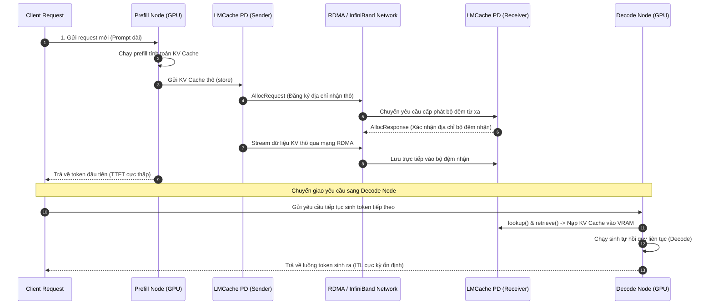

# Case Study 2: Triển khai phân tách Prefill-Decode (PD Disaggregation) trong Cụm Phục vụ Thương mại

Trong các hệ thống API phục vụ LLM quy mô công nghiệp (như DeepSeek, OpenAI, hoặc Anthropic), sự chênh lệch lớn về độ trễ giữa pha Prefill và Decode đòi hỏi một giải pháp phân tách tài nguyên triệt để. Case study này phân tích cách triển khai phân tách Prefill-Decode (*PD Disaggregation*) sử dụng kênh truyền tải hiệu năng cao của LMCache.

---

## 1. Sự căng thẳng hệ thống: Queue Blocking trong Colocated Serving

Khi chạy hệ thống serving truyền thống đồng địa hóa (*colocated serving*):
* Giai đoạn Prefill yêu cầu năng lực tính toán cực cao để chạy song song toàn bộ prompt.
* Giai đoạn Decode chạy tự hồi quy từng token một, tốn rất ít năng lực tính toán nhưng yêu cầu truy xuất bộ nhớ liên tục.
* Khi có một request mới gửi đến hệ thống, GPU phải tạm ngưng hoặc làm chậm luồng xử lý Decode của các request đang chạy để phân phối tài nguyên tính toán cho pha Prefill.

### ⚠️ Điểm nghẽn hệ thống (Tension):
Hiện tượng này gây ra lỗi **ùn tắc hàng đợi (Queue Blocking)**:
1. Độ trễ giữa các token sinh ra (*Inter-Token Latency - ITL*) tăng vọt đột ngột mỗi khi có request mới gia nhập lô xử lý.
2. Chất lượng dịch vụ (*SLA*) của khách hàng bị ảnh hưởng nghiêm trọng do độ trễ phản hồi không ổn định.

Giải pháp phân tách PD (*PD Disaggregation*) tách cụm máy chủ thành hai nhóm: nhóm chuyên Prefill (*Prefill Pool*) và nhóm chuyên Decode (*Decode Pool*). Khi Prefill Node tính toán xong ngữ cảnh và sinh ra *KV Cache*, nó bắt buộc phải đẩy dữ liệu này sang Decode Node qua mạng thời gian thực để Decode Node tiếp quản luồng sinh token tiếp theo.

---

## 2. Mô hình toán học về Chi phí Truyền tải mạng so với Tính toán lại

Để việc phân tách PD mang lại hiệu quả thực tế, thời gian truyền tải *KV Cache* qua mạng từ Prefill Node đến Decode Node ($T_{\text{transfer}}$) cộng với thời gian nạp bộ đệm phải nhỏ hơn thời gian Decode Node tự tính toán lại pha Prefill từ đầu.

Ta có công thức tính tổng thời gian truyền tải mạng vật lý:

$$T_{\text{transfer}} = \frac{S_{\text{kv}}}{B_{\text{network}}} + RTT$$

Trong đó:
* $S_{\text{kv}}$: Kích thước của *KV Cache* tính bằng bytes (áp dụng công thức tính toán ở Bài 0).
* $B_{\text{network}}$: Băng thông truyền tải thực tế của mạng kết nối (bytes/s).
* $RTT$: Độ trễ truyền dẫn vật lý vòng lặp của mạng xã hội/kết nối socket.

### 🔍 Bài toán so sánh hiệu năng thực tế:
Xét mô hình Llama-3-70B chạy Tensor Parallelism ($W=8$). Với một prompt dài 16,000 tokens, kích thước *KV Cache* cần truyền tải là $S_{\text{kv}} \approx 4.0$ GB.
* Thời gian GPU tự tính toán lại prefill cho 16,000 tokens trên một nút TP=8 ($T_{\text{prefill}}$) ước tính khoảng **400 ms**.

Ta xét hai cấu hình mạng mạng kết nối cụm máy chủ:

#### Trường hợp A: Sử dụng kết nối mạng Ethernet 10 Gbps phổ thông
* Băng thông mạng thực tế: $B_{\text{network}} \approx 1.25$ GB/s.
* Độ trễ RTT: $RTT \approx 2$ ms.

$$T_{\text{transfer}} = \frac{4.0 \text{ GB}}{1.25 \text{ GB/s}} + 0.002 \text{ s} = 3.2 \text{ s} + 0.002 \text{ s} = 3202 \text{ ms}$$

Vì $T_{\text{transfer}} = 3202 \text{ ms} \gg T_{\text{prefill}} = 400 \text{ ms}$, việc truyền tải qua mạng chậm hơn gấp 8 lần so với việc Decode Node tự tính toán lại. Mô hình disaggregation hoàn toàn mất đi giá trị thực tế.

#### Trường hợp B: Sử dụng kết nối InfiniBand RDMA 100 Gbps tốc độ cao kết hợp LMCache
* Băng thông mạng thực tế: $B_{\text{network}} \approx 12.5$ GB/s.
* Độ trễ RTT: $RTT \approx 0.5$ ms (sử dụng RDMA bypass hệ điều hành).

$$T_{\text{transfer}} = \frac{4.0 \text{ GB}}{12.5 \text{ GB/s}} + 0.0005 \text{ s} = 0.32 \text{ s} + 0.0005 \text{ s} \approx 320.5 \text{ ms}$$

Vì $T_{\text{transfer}} = 320.5 \text{ ms} < T_{\text{prefill}} = 400 \text{ ms}$, việc truyền tải nhanh hơn việc tính toán lại, giúp Decode Node tiếp quản request tức thời mà không phải chạy lại prefill, bảo toàn độ trễ ITL ổn định cho hệ thống.

---

## 3. Sơ đồ điều phối luồng xử lý cụm PD phân tách

Quy trình phối hợp truyền tải dữ liệu giữa Prefill Pool và Decode Pool thông qua LMCache PD Transfer Engine:

---

## 4. Liên hệ mã nguồn: Nixl Worker Loop và Cơ chế gửi nhận thông điệp

Luồng xử lý truyền tải mạng hiệu năng cao trong kịch bản PD Disaggregation được hiện thực hóa bởi lớp `PDBackend` định nghĩa tại file [lmcache/v1/storage_backend/pd_backend.py](file:///Users/admin/TuanDung/repos/LMCache/lmcache/v1/storage_backend/pd_backend.py).

Lớp này phân tách vai trò gửi/nhận thông qua các hàm chạy ngầm tối ưu hóa băng thông mạng:

1. **`_nixl_worker_loop()` (Vai trò Sender - Prefill Node):**
   * Luồng xử lý chạy ngầm này liên tục quét hàng đợi các tác vụ ghi dữ liệu gửi lên từ GPU Connector.
   * Thực hiện đóng gói các ma trận tensor thành các thông điệp nhị phân tối ưu hóa cấu trúc bộ nhớ thô và gửi trực tiếp qua socket mạng tốc độ cao.

2. **`_allocate_and_put()` (Vai trò Receiver - Decode Node):**
   * Khi nhận được thông điệp `AllocRequest` đăng ký địa chỉ từ nút gửi, nút nhận sẽ thực hiện cấp phát nhanh vùng nhớ trên bộ nhớ CPU/GPU thông qua lớp allocator được tối ưu hóa trước (`PagedCpuGpuMemoryAllocator`).
   * Trả về thông điệp `AllocResponse` chứa mã băm xác nhận vùng nhớ trống để nút gửi bắt đầu truyền trực tiếp dữ liệu thô.

---

## 5. Checklist triển khai cụm PD disaggregation thực tế

* [ ] **Cấu hình vai trò tiến trình**: Đảm bảo cấu hình biến `pd_role` khớp với vai trò của máy chủ (`sender` cho cụm Prefill và `receiver` cho cụm Decode).
* [ ] **Kích hoạt mạng RDMA/RoCE**: Thiết lập đúng cấu hình driver mạng để LMCache có thể truyền tải dữ liệu trực tiếp bypass hệ điều hành nhằm tối thiểu hóa $RTT$.
* [ ] **Định cấu hình địa chỉ IP nút nhận (Peer URL)**: Cấu hình đúng danh sách các địa chỉ IP của cụm Decode Node trong cấu hình YAML của các Prefill Node.
* [ ] **Cấu hình dung lượng Page Allocator**: Đảm bảo tham số kích thước trang bộ nhớ đệm khớp với kích thước khối quản lý của Serving Engine để tối ưu hóa hiệu quả cấp phát bộ đệm từ xa.
* [ ] **Giám sát băng thông mạng vật lý**: Theo dõi liên tục dung lượng mạng truyền tải giữa hai cụm để đảm bảo không bị nghẽn cổ chai vật lý tại các switch mạng.
