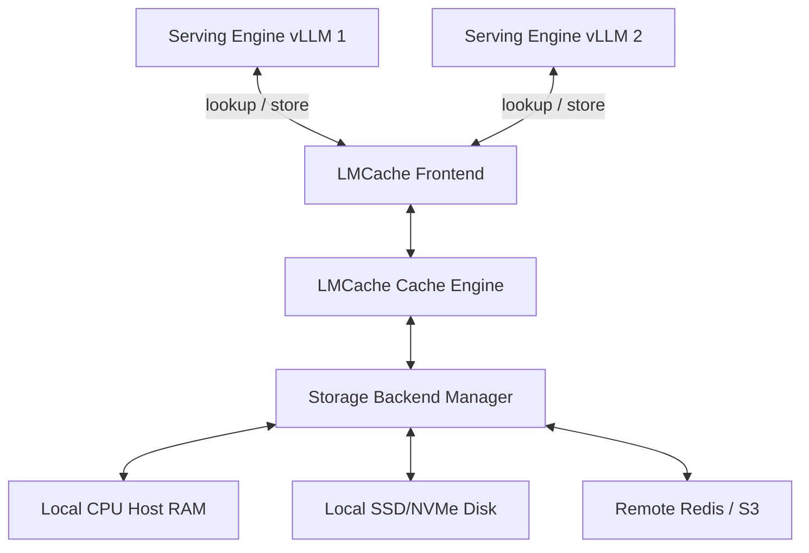

# Bài 0: Tổng quan về Chia sẻ KV Cache (KV Cache Sharing)

Trong hệ thống phục vụ mô hình ngôn ngữ lớn (*LLM Serving*), *KV Cache* đóng vai trò quyết định đối với hiệu năng hệ thống. Tuy nhiên, việc quản lý và chia sẻ *KV Cache* hiệu quả vẫn là một thách thức lớn. Bài học này sẽ phân tích bản chất của *KV Cache*, bài toán trùng lặp tiền tố (*prefix reuse*), và tại sao chúng ta cần một giải pháp chia sẻ *KV Cache* phân tán như **LMCache**.

---

## 1. Bản chất của KV Cache và sự căng thẳng phần cứng (Hardware Tension)

Quá trình suy luận LLM tự hồi quy (*Autoregressive Generation*) bao gồm hai giai đoạn chính với đặc tính phần cứng rất khác nhau:

1. **Prefill Phase (Giai đoạn tiền nạp):**
   * Hệ thống nhận vào toàn bộ câu lệnh (*prompt*) từ người dùng.
   * Tính toán các ma trận *Key* ($K$) và *Value* ($V$) cho toàn bộ token trong prompt song song.
   * Giai đoạn này cực kỳ tốn năng lực tính toán và bị giới hạn bởi năng lực tính toán của GPU (*Compute-bound*).

2. **Decode Phase (Giai đoạn giải mã):**
   * Sinh ra từng token mới tại mỗi bước thời gian (*iteration*).
   * Chỉ cần tính toán $K$ và $V$ cho duy nhất token mới sinh, nhưng bắt buộc phải truy xuất lại toàn bộ ma trận $K$ và $V$ của tất cả các token trước đó trong bộ nhớ GPU.
   * Giai đoạn này bị giới hạn bởi băng thông bộ nhớ của GPU (*Memory-bandwidth bound*).

Để tránh việc phải tính toán lại ma trận $K$ và $V$ của các token trước đó ở mỗi bước sinh token mới, chúng được lưu trữ lại trong bộ nhớ GPU dưới dạng **KV Cache**. 

### ⚠️ Căng thẳng phần cứng (Hardware Tension):
Khi chiều dài ngữ cảnh (*context length*) tăng lên, dung lượng *KV Cache* phình to cực nhanh và chiếm dụng phần lớn bộ nhớ VRAM của GPU. Điều này dẫn đến hiện tượng nghẽn cổ chai bộ nhớ, giới hạn kích thước lô (*batch size*), và gây ra lỗi tràn bộ nhớ (*Out-of-Memory - OOM*). Từ đó, chúng ta buộc phải tìm cách giải phóng hoặc offload bộ đệm này ra ngoài VRAM GPU.

---

## 2. Mô hình toán học về dung lượng KV Cache

Để đánh giá chính xác tải hệ thống, chúng ta xây dựng công thức tính kích thước của *KV Cache* cho một yêu cầu duy nhất. Kích thước bộ đệm *KV Cache* ($S_{\text{kv}}$) tính bằng bytes được xác định bởi công thức sau:

$$S_{\text{kv}} = 2 \times n_{\text{layers}} \times n_{\text{kv\_heads}} \times d_{\text{head}} \times L_{\text{seq}} \times b_{\text{param}}$$

Đọc công thức này theo nghĩa thực tế hệ thống:
* Hằng số $2$ đại diện cho hai ma trận độc lập: ma trận *Key* ($K$) và ma trận *Value* ($V$).
* $n_{\text{layers}}$: Số lượng lớp Transformer trong kiến trúc mô hình (ví dụ: Llama 3 8B có 32 lớp).
* $n_{\text{kv\_heads}}$: Số lượng đầu tính toán của ma trận KV. Trong cơ chế *Grouped-Query Attention (GQA)*, số lượng đầu KV nhỏ hơn số đầu Query ($n_{\text{kv\_heads}} < n_{\text{q\_heads}}$) để giảm bộ nhớ.
* $d_{\text{head}}$: Kích thước của mỗi đầu (*head dimension*, thường là 128).
* $L_{\text{seq}}$: Chiều dài chuỗi token cần lưu trữ (bao gồm cả prompt và phần sinh thêm).
* $b_{\text{param}}$: Số bytes chiếm dụng trên mỗi tham số tùy thuộc vào định dạng dữ liệu (ví dụ: FP16/BF16 chiếm 2 bytes, FP8 chiếm 1 byte).

### 🔍 Ví dụ thực tế:
Xét mô hình Llama-3-8B chạy ở định dạng BF16 ($b_{\text{param}} = 2$):
* $n_{\text{layers}} = 32$
* $n_{\text{kv\_heads}} = 8$ (sử dụng GQA)
* $d_{\text{head}} = 128$
* Chiều dài chuỗi $L_{\text{seq}} = 8,000$ tokens.

Tính toán kích thước *KV Cache*:

$$S_{\text{kv}} = 2 \times 32 \times 8 \times 128 \times 8000 \times 2 = 1,048,576,000 \text{ bytes} \approx 0.98 \text{ GB}$$

Bản chất của công thức nằm ở việc: Chỉ với một request dài 8k tokens, hệ thống đã tốn gần 1 GB VRAM chỉ để lưu trữ *KV Cache*. Nếu chạy song song với kích thước lô (*batch size*) là 32, dung lượng cần dùng là $\approx 31.25$ GB, vượt quá dung lượng VRAM vật lý của nhiều GPU thông dụng (như A10G 24GB, L4 24GB).

---

## 3. Thách thức về trùng lặp tiền tố (Prefix Reuse)

Trong các hệ thống thực tế, rất nhiều request chia sẻ chung một phần tiền tố (*prefix*) dài:
* **Hệ thống RAG (Retrieval-Augmented Generation):** Nhiều câu hỏi của người dùng cùng truy vấn và tham chiếu đến cùng một tài liệu ngữ cảnh (*context document*).
* **Multi-round Conversations (Trò chuyện nhiều lượt):** Lịch sử hội thoại được đính kèm vào mỗi lượt hỏi mới của người dùng.
* **Agentic Workflows:** Các prompt chỉ dẫn hệ thống phức tạp và định dạng đầu ra (*JSON Schema*) được lặp lại liên tục.

Nếu không tối ưu, hệ thống phải chạy lại pha **Prefill** để tính toán lại *KV Cache* cho các tiền tố này ở mỗi request mới. Điều này làm lãng phí năng lực tính toán của GPU và tăng đáng kể thời gian phản hồi từ đầu (*Time to First Token - TTFT*).

Các công cụ phục vụ như vLLM đã hiện thực cơ chế **Automatic Prefix Caching (APC)** cấp độ đơn instance bằng cách sử dụng cấu trúc bảng trang (*Page Table*) của **PagedAttention**:
* Khi một request hoàn tất, các khối *KV Cache* của tiền tố được giữ lại trên VRAM.
* Nếu request mới trùng khớp mã băm (*hash*), vLLM sẽ ánh xạ trực tiếp bảng trang logical sang các physical blocks sẵn có.

### ⚠️ Giới hạn của APC truyền thống:
1. **Chỉ hoạt động cục bộ (Single Instance):** Không thể chia sẻ *KV Cache* từ GPU 0 sang GPU 1 hoặc giữa các máy chủ khác nhau trong cụm.
2. **Giới hạn dung lượng VRAM:** Khi VRAM đầy do tải thực tế, các khối *KV Cache* cũ lưu trữ tiền tố sẽ bị giải phóng (*evicted*), buộc hệ thống phải tính toán lại ở lần truy cập sau.

---

## 4. Giải pháp: LMCache Phân tán (Distributed KV Cache Sharing)

**LMCache** giải quyết các giới hạn trên bằng cách tách biệt việc quản lý và lưu trữ *KV Cache* ra khỏi GPU VRAM và tiến trình serving engine cục bộ.

### 🛠️ Liên hệ mã nguồn LMCache:
Trong codebase của LMCache, giao thức tương tác chính này được điều phối bởi lớp `LMCacheEngine` định nghĩa tại file [lmcache/v1/cache_engine.py](file:///Users/admin/TuanDung/repos/LMCache/lmcache/v1/cache_engine.py). Ba phương thức public cốt lõi đại diện cho luồng nghiệp vụ này bao gồm:
* `lookup(self, tokens, ...)`: Nhận diện và kiểm tra xem chuỗi token đã có sẵn *KV Cache* trong hệ thống lưu trữ phân tán hay chưa.
* `store(self, tokens, kv_tensors, ...)`: Nhận các tensor từ GPU, thực hiện định dạng và đẩy xuống lưu trữ bất đồng bộ ở các tầng lưu trữ vật lý.
* `retrieve(self, tokens, ...)`: Lấy dữ liệu *KV Cache* từ các phân tầng lưu trữ thích hợp và nạp lại vào GPU phục vụ cho quá trình sinh token.

---

## 5. Checklist thiết kế hệ thống cho Kỹ sư Serving

Khi triển khai cơ chế chia sẻ *KV Cache* cho một cụm máy chủ, bạn cần thực hiện checklist đánh giá dung lượng bộ đệm sau:

* [ ] **Xác định thông số mô hình**: Thu thập chính xác số layer ($n_{\text{layers}}$), số đầu KV ($n_{\text{kv\_heads}}$), và head dimension ($d_{\text{head}}$).
* [ ] **Định mức kích thước ngữ cảnh trung bình**: Ước lượng chiều dài tiền tố dùng chung ($L_{\text{prefix}}$) và tổng chiều dài chuỗi sinh ra ($L_{\text{seq}}$).
* [ ] **Tính toán giới hạn VRAM**: Áp dụng công thức $S_{\text{kv}}$ để xác định dung lượng cần thiết trên mỗi luồng sinh. Xác nhận xem dung lượng VRAM còn lại sau khi load mô hình có đủ chứa kích thước lô mục tiêu hay không.
* [ ] **Đo lường thời gian Prefill**: Kiểm tra thời gian GPU chạy prefill ($T_{\text{prefill}}$) cho các độ dài prompt khác nhau để làm mốc so sánh với thời gian truyền tải mạng của *KV Cache*.
* [ ] **Cấu hình chia sẻ**: Xác định xem các máy chủ serving có dùng chung phân đoạn prompt nào không để quyết định kích hoạt chế độ lưu trữ từ xa (*Redis/MinIO*) hay chỉ lưu cục bộ (*CPU Host RAM*).
