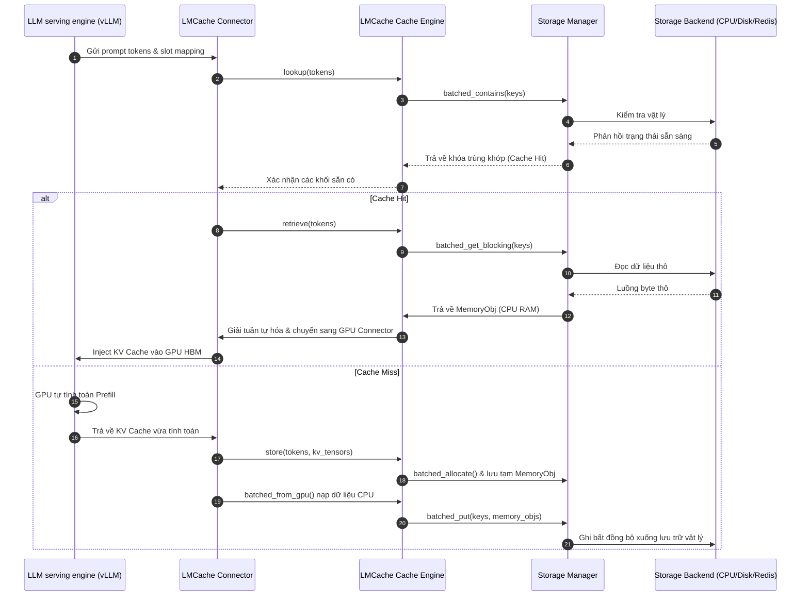

# Bài 1: Chi tiết Kiến trúc Hệ thống LMCache

Để cung cấp khả năng chia sẻ *KV Cache* hiệu năng cao trên quy mô cụm máy chủ, LMCache sử dụng thiết kế kiến trúc phân tầng gồm 3 lớp chính: **Frontend**, **Cache Engine**, và **Storage Backend**. Bài học này sẽ đi sâu phân tích sơ đồ kiến trúc tổng quan và chức năng của từng lớp trong mã nguồn LMCache.

---

## 1. Sự căng thẳng hệ thống: Thời gian truy xuất vs Thời gian tính toán lại (Systems Tension)

Tại sao không phải lúc nào chia sẻ *KV Cache* cũng mang lại hiệu năng tốt hơn? Đó là do sự cân bằng động giữa thời gian truyền tải và thời gian tính toán lại trên GPU.

Khi ta có một khối *KV Cache* lưu trữ trên CPU RAM hoặc trên mạng (Redis):
* Hệ thống sẽ tốn chi phí thời gian để kiểm tra cache, đóng gói dữ liệu, gửi qua mạng hoặc qua bus PCIe, giải nén và nạp vào bộ nhớ HBM của GPU.
* Nếu tổng thời gian thực hiện luồng này lớn hơn thời gian GPU tự tính toán lại pha Prefill cho các token đó, việc dùng LMCache sẽ phản tác dụng và làm tăng tổng thời gian phản hồi (*latency*).

Đây chính là **sự căng thẳng hệ thống (Systems Tension)**: Cần thiết kế một luồng xử lý cực kỳ tối ưu để thời gian truy xuất từ xa luôn nhỏ hơn thời gian tính toán cục bộ của GPU.

---

## 2. Mô hình toán học về Latency và hiệu quả Caching

Để xác định xem việc truy xuất *KV Cache* từ LMCache có mang lại lợi ích hiệu năng hay không, ta xây dựng mô hình toán học so sánh thời gian.

Tổng thời gian truy xuất và nạp *KV Cache* ($T_{\text{retrieve}}$) được xác định bằng tổng các thành phần:

$$T_{\text{retrieve}} = T_{\text{lookup}} + T_{\text{fetch}} + T_{\text{deserialize}} + T_{\text{hbm_inject}}$$

Trong đó:
* $T_{\text{lookup}}$: Thời gian truy vấn chỉ mục (mã băm) trong cơ sở dữ liệu token để xác định cache hit/miss.
* $T_{\text{fetch}}$: Thời gian truyền tải vật lý các byte dữ liệu của tensor từ Storage Backend (CPU RAM, SSD, hoặc Redis qua mạng) vào bộ nhớ RAM tiến trình.
* $T_{\text{deserialize}}$: Thời gian giải tuần tự hóa (*deserialization*), chuyển đổi luồng byte thô thành tensor PyTorch có cấu trúc và kiểu dữ liệu phù hợp.
* $T_{\text{hbm_inject}}$: Thời gian ghi dữ liệu từ CPU RAM qua bus PCIe vào VRAM/HBM của GPU.

Ngược lại, thời gian GPU tự tính toán lại pha Prefill cho đoạn tiền tố đó ($T_{\text{prefill}}$) được mô tả như sau:

$$T_{\text{prefill}} = \frac{L_{\text{seq}} \cdot C_{\text{compute}}}{P_{\text{compute}}} + T_{\text{overhead}}$$

Trong đó:
* $L_{\text{seq}}$: Độ dài chuỗi tiền tố (số lượng tokens).
* $C_{\text{compute}}$: Số lượng FLOPs cần tính toán cho mỗi token trong pha Prefill (thường xấp xỉ $2 \times N_{\text{params}}$ của mô hình).
* $P_{\text{compute}}$: Hiệu suất tính toán thực tế của GPU (FLOPs/s chạy ở tensor core).
* $T_{\text{overhead}}$: Các chi phí cố định khác của runtime (lập lịch, cấp phát bộ nhớ của engine).

### 💡 Điều kiện tối ưu:
Hệ thống chỉ đạt hiệu năng cao khi và chỉ khi thỏa mãn bất đẳng thức:

$$T_{\text{retrieve}} < T_{\text{prefill}}$$

Bản chất của công thức nằm ở việc: Vì $T_{\text{prefill}}$ tăng tuyến tính theo chiều dài chuỗi $L_{\text{seq}}$ trong khi $T_{\text{retrieve}}$ chịu ảnh hưởng nhiều bởi các hằng số truyền tải vật lý, việc chia sẻ *KV Cache* sẽ cực kỳ hiệu quả đối với các ngữ cảnh rất dài (ví dụ: prompt > 1,000 tokens) và có thể không tối ưu cho các prompt quá ngắn.

---

## 3. Sơ đồ luồng điều khiển và dữ liệu (Control & Data Flow)

Dưới đây là sơ đồ chi tiết luồng tương tác giữa các thành phần của LMCache khi một yêu cầu phục vụ được xử lý:



---

## 4. Liên hệ mã nguồn: Khởi tạo Storage Manager

Trong lớp `LMCacheEngine` tại [lmcache/v1/cache_engine.py](file:///Users/admin/TuanDung/repos/LMCache/lmcache/v1/cache_engine.py), việc thiết lập các phân tầng lưu trữ không diễn ra ngay trong hàm khởi dựng `__init__`, mà được trì hoãn đến giai đoạn gọi hàm `post_init()`.

Hàm `post_init` thực hiện khởi tạo đối tượng `StorageManager` quản lý dòng dữ liệu vật lý:

```python
    def post_init(self, **kwargs) -> None:
        if not self.post_inited:
            logger.info("Post initializing LMCacheEngine")
            # ... đoạn mã kiểm tra worker IDs ...
            if (
                self.lmcache_worker is not None
                or self.use_layerwise
                or not self.save_only_first_rank
                or self.metadata.is_first_rank()
                # ...
            ):
                # Khởi tạo StorageManager kết nối với các Storage Backends
                self.storage_manager = StorageManager(
                    self.config,
                    self.metadata,
                    event_manager=self.event_manager,
                    lmcache_worker=self.lmcache_worker,
                    async_lookup_server=async_lookup_server,
                )
            self.post_inited = True
```

`StorageManager` (nằm ở [lmcache/v1/storage_backend/storage_manager.py](file:///Users/admin/TuanDung/repos/LMCache/lmcache/v1/storage_backend/storage_manager.py)) chịu trách nhiệm làm việc với các backend thô như `LocalCPUBackend`, `LocalDiskBackend`, và `RemoteBackend` để thực thi lệnh đọc ghi dữ liệu thô.

---

## 5. Checklist tích hợp LMCache vào Serving Engine

Trước khi khởi chạy hệ thống phục vụ tích hợp LMCache, kỹ sư serving cần kiểm tra cấu hình sau:

* [ ] **Xác nhận cấu hình công cụ phục vụ**: Đảm bảo phiên bản vLLM hoặc SGLang tương thích với lớp adapter của LMCache.
* [ ] **Cấu hình biến môi trường**: Thiết lập đúng đường dẫn file cấu hình YAML qua biến môi trường `LMCACHE_CONFIG_FILE`.
* [ ] **Xác thực cổng mạng**: Đảm bảo các tiến trình engine có thể kết nối đến máy chủ Redis/Object Storage trung tâm (nếu dùng `RemoteBackend`).
* [ ] **Giới hạn tài nguyên CPU**: Kiểm tra dung lượng RAM tối đa cho phép lưu trữ cache trên máy chủ để cấu hình đúng tham số bộ nhớ trong LMCache.
* [ ] **Đo lường Latency Baseline**: Ghi lại thời gian phản hồi TTFT của hệ thống trước khi bật LMCache để đánh giá mức độ cải thiện hiệu năng thực tế.
