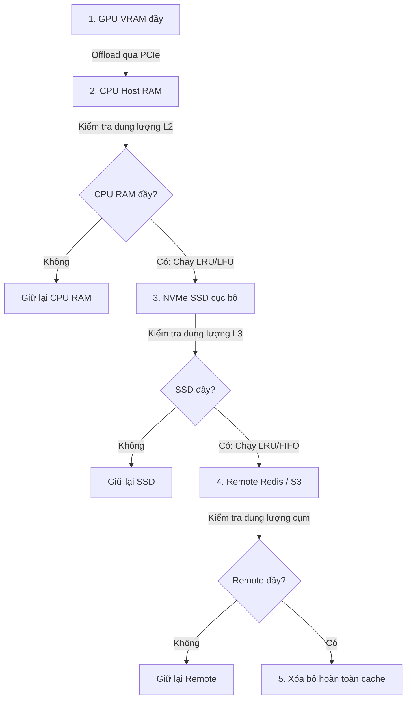

# Bài 2: Cơ chế Lưu trữ Phân cấp và Quản lý Bộ nhớ trong LMCache

Để tối ưu hóa chi phí phần cứng trong khi vẫn đảm bảo băng thông và độ trễ truy cập tối thiểu, LMCache thiết kế cơ chế lưu trữ phân cấp (*Hierarchical Storage*). Bài học này sẽ phân tích các bài toán đánh đổi vật lý, mô hình toán học về kỳ vọng độ trễ, cấu trúc mã nguồn các lớp backend lưu trữ, và cách hiện thực hóa các giải thuật giải phóng bộ nhớ (*cache eviction*).

---

## 1. Sự căng thẳng vật lý của các tầng lưu trữ (Systems Tension)

Mỗi tầng lưu trữ trong hệ thống máy tính đều có sự đánh đổi rõ ràng giữa **dung lượng lưu trữ** và **băng thông/độ trễ**:

| Tầng lưu trữ | Thiết bị | Dung lượng | Băng thông truyền tải | Độ trễ truy xuất |
| :--- | :--- | :--- | :--- | :--- |
| **GPU VRAM** | HBM3/HBM2e | Cực nhỏ (24GB - 80GB) | Cực cao (2TB/s - 3TB/s) | Cực thấp (~nanoseconds) |
| **CPU Host RAM** | DDR5/DDR4 | Trung bình (128GB - 1TB) | Trung bình (50GB/s - 100GB/s) | Thấp (~microseconds) |
| **Local Disk** | NVMe SSD | Lớn (1TB - 8TB) | Thấp (5GB/s - 7GB/s via PCIe) | Trung bình (~milliseconds) |
| **Remote Storage** | Redis/MinIO | Cực lớn (Quy mô cụm) | Bị giới hạn bởi mạng (10Gbps - 100Gbps) | Cao (Phụ thuộc mạng/RTT) |

### ⚠️ Sự căng thẳng (Tension):
Nếu chúng ta chỉ lưu *KV Cache* trên GPU VRAM, hệ thống sẽ nhanh chóng bị tràn bộ nhớ (OOM) khi gặp prompt dài hoặc lượng request lớn. Nếu lưu trữ toàn bộ trên Redis hoặc SSD, thời gian truyền tải dữ liệu qua mạng hoặc qua bus PCIe sẽ quá lớn, làm giảm hiệu năng phục vụ. Do đó, LMCache phải điều phối dòng chảy dữ liệu một cách thông minh, đảm bảo dữ liệu "nóng" luôn nằm ở tầng tốc độ cao, dữ liệu "lạnh" được đẩy xuống tầng dung lượng lớn.

---

## 2. Mô hình toán học về Kỳ vọng Độ trễ phân cấp

Ta xây dựng mô hình toán học để tối ưu hóa việc phân bổ dữ liệu trên các tầng lưu trữ. Kỳ vọng thời gian phản hồi ($E[T]$) khi truy xuất một khối *KV Cache* được xác định bởi công thức:

$$E[T] = P_{\text{cpu}} T_{\text{cpu}} + P_{\text{disk}} T_{\text{disk}} + P_{\text{remote}} T_{\text{remote}} + (1 - P_{\text{hit}}) T_{\text{prefill}}$$

Trong đó:
* $P_{\text{cpu}}$: Xác suất tìm thấy dữ liệu (*cache hit*) trên bộ nhớ CPU Host RAM cục bộ.
* $T_{\text{cpu}}$: Thời gian giải tuần tự hóa và nạp dữ liệu từ CPU RAM vào GPU VRAM.
* $P_{\text{disk}}$: Xác suất tìm thấy dữ liệu trên ổ cứng NVMe cục bộ (sau khi trượt cache ở tầng CPU RAM).
* $T_{\text{disk}}$: Thời gian đọc từ SSD, nạp vào RAM rồi đẩy lên GPU VRAM.
* $P_{\text{remote}}$: Xác suất tìm thấy dữ liệu trên Redis/Object Storage từ xa qua mạng (sau khi trượt ở hai tầng cục bộ).
* $T_{\text{remote}}$: Thời gian tải qua mạng, giải nén và nạp vào GPU VRAM.
* $P_{\text{hit}}$: Tổng xác suất trúng cache của toàn hệ thống, với $P_{\text{hit}} = P_{\text{cpu}} + P_{\text{disk}} + P_{\text{remote}}$.
* $(1 - P_{\text{hit}})$: Xác suất trượt cache hoàn toàn, buộc GPU phải thực hiện tính toán lại pha Prefill.
* $T_{\text{prefill}}$: Thời gian GPU tự tính toán lại các token.

### 📈 Phân tích bản chất:
Mục tiêu của LMCache là tối thiểu hóa $E[T]$. Để làm được điều này, hệ thống cần:
1. Tối đa hóa tổng xác suất trúng cache $P_{\text{hit}}$ bằng các chính sách chia sẻ phân tán.
2. Tối đa hóa xác suất của tầng nhanh nhất ($P_{\text{cpu}}$) bằng các thuật toán dọn dẹp và dự đoán thông minh như *LRU (Least Recently Used)* hoặc *LFU (Least Frequently Used)*.

---

## 3. Sơ đồ dịch chuyển dữ liệu và giải phóng bộ nhớ (Eviction Pipeline)

Quy trình tự động offload và giải phóng bộ nhớ (*eviction*) diễn ra tuần tự khi các tầng lưu trữ chạm ngưỡng giới hạn dung lượng:



---

## 4. Liên hệ mã nguồn: Interface và các Backend lưu trữ

Trong thư mục mã nguồn [lmcache/v1/storage_backend](file:///Users/admin/TuanDung/repos/LMCache/lmcache/v1/storage_backend), các lớp lưu trữ được thiết kế hướng đối tượng rất rõ ràng:

1. **Lớp giao diện trừu tượng (`StorageBackendInterface`):**
   Được định nghĩa tại [abstract_backend.py](file:///Users/admin/TuanDung/repos/LMCache/lmcache/v1/storage_backend/abstract_backend.py). Mọi backend đều phải hiện thực hóa các phương thức giao tiếp chuẩn:
   ```python
   class StorageBackendInterface(metaclass=abc.ABCMeta):
       @abc.abstractmethod
       def contains(self, key: CacheEngineKey, pin: bool = False) -> bool: ...
       @abc.abstractmethod
       def batched_submit_put_task(self, keys: List[CacheEngineKey], memory_objs: List[MemoryObj], ...) -> None: ...
       @abc.abstractmethod
       def get_blocking(self, key: CacheEngineKey, memory_obj: MemoryObj) -> void: ...
   ```

2. **Các Backend vật lý:**
   * `LocalCPUBackend` tại [local_cpu_backend.py](file:///Users/admin/TuanDung/repos/LMCache/lmcache/v1/storage_backend/local_cpu_backend.py): Quản lý bộ nhớ RAM thô của CPU máy chủ.
   * `LocalDiskBackend` tại [local_disk_backend.py](file:///Users/admin/TuanDung/repos/LMCache/lmcache/v1/storage_backend/local_disk_backend.py): Quản lý lưu trữ tệp tin nhị phân trên SSD.
   * `RemoteBackend` tại [remote_backend.py](file:///Users/admin/TuanDung/repos/LMCache/lmcache/v1/storage_backend/remote_backend.py): Tương tác với Redis từ xa thông qua lớp client tối ưu.

3. **Chính sách giải phóng bộ nhớ (`cache_policy/`):**
   Lớp dọn dẹp cache `LRUPolicy` tại [cache_policy/lru.py](file:///Users/admin/TuanDung/repos/LMCache/lmcache/v1/storage_backend/cache_policy/lru.py) sử dụng cấu trúc dữ liệu bản đồ băm kết hợp danh sách liên kết đôi để dọn dẹp các phần tử lâu nhất không được truy cập:
   ```python
   # lmcache/v1/storage_backend/cache_policy/lru.py
   # Sử dụng để tự động tìm các khóa cần bị đẩy xuống tầng SSD hoặc xóa bỏ
   ```

---

## 5. Checklist tinh chỉnh bộ nhớ phân cấp (Memory Tuning Checklist)

Khi vận hành LMCache trong môi trường production, bạn cần cấu hình và giám sát các thông số bộ nhớ sau:

* [ ] **Đặt giới hạn CPU RAM (L2)**: Định cấu hình dung lượng bộ nhớ CPU RAM tối đa trong cấu hình YAML (ví dụ: `max_cpu_memory_gb: 128`). Tránh cấu hình vượt quá dung lượng vật lý để không bị lỗi Linux Out-Of-Memory Killer.
* [ ] **Cấu hình đường dẫn SSD (L3)**: Đảm bảo thư mục lưu trữ disk nằm trên ổ cứng NVMe SSD tốc độ cao, tránh các ổ cứng HDD thông thường để giảm thiểu $T_{\text{disk}}$.
* [ ] **Lựa chọn Cache Policy**: Đánh giá hành vi truy cập prompt (truy cập lặp lại gần đây hay lặp lại nhiều lần) để cấu hình chính sách dọn dẹp bộ đệm phù hợp (`lru` hoặc `lfu`).
* [ ] **Bật cơ chế nén dữ liệu (Compression)**: Đối với các backend truyền qua mạng như `RemoteBackend`, hãy bật cơ chế nén trong file cấu hình để giảm dung lượng truyền tải, từ đó giảm thiểu đáng kể $T_{\text{remote}}$.
* [ ] **Giám sát Cache Hit Rate**: Đo lường tỷ lệ trúng cache cục bộ ($P_{\text{cpu}}$) và trượt cache hoàn toàn để liên tục điều chỉnh dung lượng của từng phân tầng lưu trữ.
