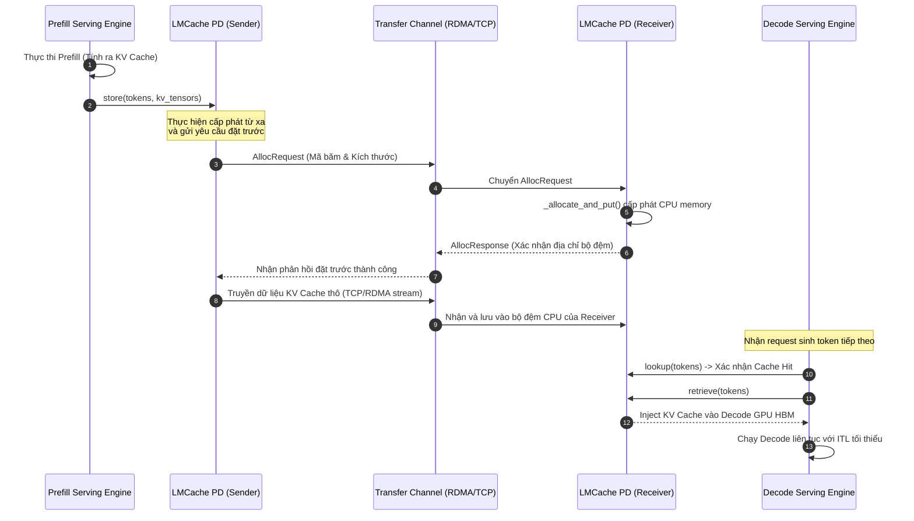

# Bài 3: Giải pháp Phân tách Prefill-Decode (PD Disaggregation)

Trong các hệ thống phục vụ mô hình ngôn ngữ lớn quy mô công nghiệp, việc đồng địa hóa (*colocation*) hai giai đoạn Prefill và Decode trên cùng một GPU tạo ra sự tranh chấp tài nguyên và làm tăng đáng kể độ trễ. Bài học này sẽ phân tích chi tiết sự căng thẳng phần cứng dẫn đến nhu cầu phân tách Prefill-Decode (*PD Disaggregation*), xây dựng công thức giới hạn băng thông truyền tải, và tìm hiểu cơ chế hoạt động của `PDBackend` trong LMCache.

---

## 1. Sự căng thẳng hệ thống: Tranh chấp tài nguyên giữa Prefill và Decode

Trong một Serving Engine truyền thống, các request ở pha Prefill (yêu cầu năng lực tính toán cực cao, Compute-bound) và các request ở pha Decode (yêu cầu băng thông bộ nhớ cực cao, Memory-bandwidth bound) được xử lý đồng thời trong cùng một lô (*batch*) trên cùng một GPU.

Điều này dẫn đến hiện tượng **tranh chấp tài nguyên (Resource Contention)**:
* Một bước giải mã (*decode step*) cực kỳ nhanh (chỉ mất khoảng 10-30 ms) thường phải xếp hàng chờ đợi một bước tính toán prefill dài (mất hàng trăm ms) của một request mới đến hoàn thành.
* Hiện tượng này gây ra độ trễ giải mã không ổn định, tăng chỉ số độ trễ trễ giữa các token (*Inter-Token Latency - ITL*), và kéo giảm hiệu suất sử dụng GPU tổng thể.

### 💡 Giải pháp: Phân tách Prefill-Decode (PD Disaggregation)
Chúng ta tách cụm máy chủ thành hai nhóm riêng biệt:
1. **Prefill Nodes:** Chỉ nhận request mới, chạy pha Prefill ở tốc độ tính toán tối đa, sinh ra *KV Cache* ban đầu.
2. **Decode Nodes:** Nhận các token đã được tính toán sẵn *KV Cache*, chỉ chạy pha Decode để sinh token mới một cách liên tục.

Tuy nhiên, mô hình này mở ra một thách thức mới: Làm sao truyền tải toàn bộ dung lượng *KV Cache* khổng lồ được sinh ra ở Prefill Node sang Decode Node qua mạng trong thời gian ngắn nhất?

---

## 2. Mô hình toán học về Giới hạn Băng thông mạng (Network Bound)

Để giải pháp phân tách PD mang lại hiệu quả thực tế, thời gian truyền tải *KV Cache* qua mạng phải nhỏ hơn thời gian tính toán lại prompt trên Decode Node. Ta xây dựng công thức tính độ trễ truyền tải mạng ($\text{Latency}_{\text{network}}$):

$$\text{Latency}_{\text{network}} = \frac{S_{\text{kv}}}{B_{\text{network}}} + RTT$$

Trong đó:
* $S_{\text{kv}}$: Kích thước của *KV Cache* tính bằng bytes (áp dụng công thức ở Bài 0).
* $B_{\text{network}}$: Băng thông mạng thực tế giữa các nút (bytes/s, ví dụ: mạng 10 GbE đạt $\approx 1.25$ GB/s, mạng InfiniBand 100 Gbps đạt $\approx 12.5$ GB/s).
* $RTT$ (*Round-Trip Time*): Độ trễ vòng lặp mạng và các chi phí thiết lập kết nối socket thô.

### ⚖️ Điều kiện khả thi của hệ thống:
Giải pháp disaggregation chỉ tối ưu khi:

$$\text{Latency}_{\text{network}} < T_{\text{prefill}}$$

Đọc công thức này theo nghĩa toán học và thực tế:
Nếu chúng ta dùng mạng ethernet Gigabit thông thường ($B_{\text{network}} \approx 125$ MB/s), thời gian truyền 1 GB *KV Cache* sẽ mất tới 8 giây, lớn hơn rất nhiều so với thời gian GPU tự chạy prefill ($T_{\text{prefill}} \approx 100-500$ ms). Lúc này, disaggregation hoàn toàn thất bại. Ngược lại, nếu chạy trong cụm máy chủ hỗ trợ mạng InfiniBand RDMA tốc độ cao ($B_{\text{network}} \approx 10-25$ GB/s) kết hợp với LMCache, thời gian truyền tải chỉ còn $\approx 40-100$ ms, tức là nhỏ hơn thời gian tính toán lại, giúp tối ưu hóa ITL đáng kể.

---

## 3. Sơ đồ tương tác truyền tải KV Cache (PD Transfer Flow)

Quy trình phối hợp truyền tải dữ liệu giữa Prefill Node và Decode Node thông qua kênh truyền tải hiệu năng cao của LMCache:



---

## 4. Liên hệ mã nguồn: Hiện thực hóa PDBackend trong LMCache

Kịch bản phân tách Prefill-Decode được cấu hình và thực thi bởi lớp `PDBackend` định nghĩa trong file [lmcache/v1/storage_backend/pd_backend.py](file:///Users/admin/TuanDung/repos/LMCache/lmcache/v1/storage_backend/pd_backend.py). 

Lớp `PDBackend` kế thừa từ lớp `AllocatorBackendInterface` và có cấu trúc đa luồng để phân tách vai trò gửi/nhận:

1. **Khởi tạo và cấu hình vai trò:**
   Tùy thuộc vào vai trò của nút phục vụ được định nghĩa trong cấu hình (`pd_role` là `sender` hay `receiver`), hệ thống sẽ khởi chạy luồng xử lý tương ứng:
   ```python
   # lmcache/v1/storage_backend/pd_backend.py
   def __init__(self, config: LMCacheEngineConfig, ...):
       # ...
       if self.pd_role == "sender":
           self._init_sender()
       elif self.pd_role == "receiver":
           self._init_receiver()
   ```

2. **Vai trò Sender (nút Prefill):**
   * Phương thức `batched_submit_put_task()` đóng gói ma trận KV, chuyển đổi kiểu dữ liệu và đẩy vào hàng đợi của luồng mạng gửi (`_nixl_worker_loop`).
   * Sử dụng thông điệp `AllocRequest` gửi qua giao thức TCP/RDMA để đặt trước địa chỉ bộ đệm trên nút nhận.

3. **Vai trò Receiver (nút Decode):**
   * Khởi chạy luồng chạy ngầm `_cache_query_loop` để xử lý các yêu cầu truy vấn cache từ xa từ nút Decode.
   * Nhận các luồng byte, gọi hàm giải tuần tự hóa thô và lưu trực tiếp vào cấu trúc trang nhớ được quản lý bởi `PagedCpuGpuMemoryAllocator`.

---

## 5. Checklist triển khai cụm phục vụ phân tách PD

Khi thiết lập cụm LLM Serving chạy phân tách Prefill-Decode kết hợp LMCache, bạn cần thực hiện checklist kỹ thuật sau:

* [ ] **Định cấu hình vai trò nút**: Gán đúng thuộc tính `pd_role` (`sender` cho Prefill Node và `receiver` cho Decode Node) trong file cấu hình YAML của LMCache trên từng máy chủ.
* [ ] **Kiểm tra băng thông mạng cụm**: Sử dụng các công cụ đo băng thông thực tế (ví dụ: `iperf3` hoặc `ib_write_bw` cho InfiniBand) để đảm bảo mạng đạt tối thiểu 10 Gbps (khuyên dùng >= 100 Gbps).
* [ ] **Đo lường RTT mạng**: Xác minh độ trễ ping vòng lặp mạng giữa các máy chủ nhỏ hơn 1 ms để giảm thiểu chi phí thiết lập thông điệp điều khiển.
* [ ] **Đồng bộ hóa Tokenizer**: Đảm bảo các mô hình tokenizer trên cả hai cụm Prefill và Decode giống hệt nhau để các mã băm token IDs so khớp chính xác.
* [ ] **Cấu hình hàng đợi bất đồng bộ**: Điều chỉnh kích thước bộ đệm gửi nhận trong LMCache để tránh nghẽn luồng I/O khi lượng request Prefill đổ về dồn dập.
