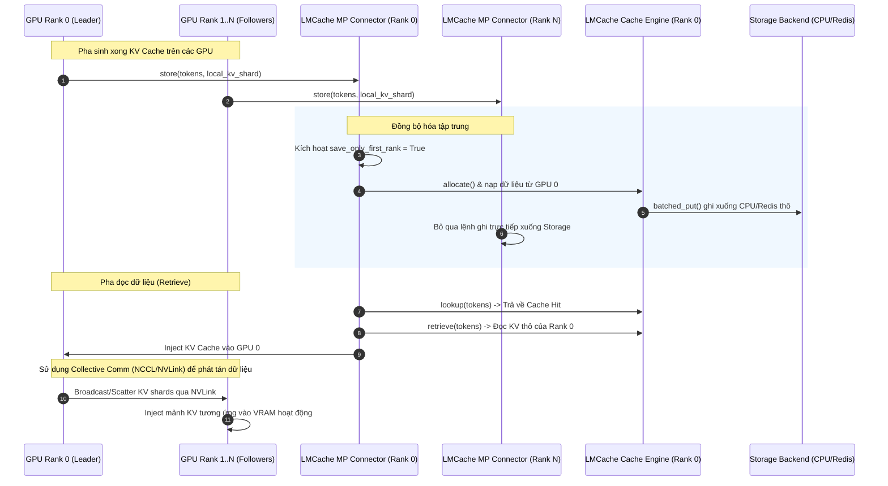

# Bài 4: Tích hợp LMCache vào vLLM và SGLang trong môi trường Multi-GPU

Trong môi trường thực tế, các mô hình ngôn ngữ lớn thường được chạy trên cấu hình đa GPU sử dụng cơ chế song song hóa tensor (*Tensor Parallelism - TP*). Việc tích hợp LMCache vào các Serving Engine như vLLM hoặc SGLang đòi hỏi một giải pháp điều phối đa tiến trình thông minh để tránh overhead băng thông PCIe. Bài học này sẽ phân tích các thách thức đa tiến trình, mô hình toán học về băng thông PCIe, cấu trúc mã nguồn các adapter tích hợp, và quy trình cấu hình hệ thống.

---

## 1. Sự căng thẳng hệ thống: Caching độc lập trong Tensor Parallelism (Systems Tension)

Trong cơ chế *Tensor Parallelism (TP)* với độ rộng $W$ (World Size):
* Mô hình được phân mảnh theo chiều dọc của các lớp chiếu ma trận, dẫn đến việc mỗi GPU trong số $W$ GPU chỉ lưu trữ và tính toán một phần chia (*slice*) của ma trận *KV Cache*.
* Ví dụ, với TP=8, mỗi GPU lưu trữ đúng $1/8$ chiều rộng của *KV Cache* cho cùng một token.

### ⚠️ Sự căng thẳng (Tension):
Nếu mỗi tiến trình GPU (rank) gọi độc lập các lệnh `store()` hoặc `retrieve()` để ghi/đọc phần cache của mình lên CPU RAM hoặc Redis qua PCIe bus:
1. Hệ thống sẽ sinh ra $W$ phiên cấp phát bộ nhớ, $W$ tiến trình serialization độc lập trên CPU máy chủ, gây quá tải bộ xử lý và phân mảnh RAM.
2. Tạo ra hiện tượng nghẽn băng thông PCIe cục bộ do các luồng truyền tải xảy ra đồng thời.
3. Làm tiêu tốn băng thông mạng gấp $W$ lần khi ghi từ các GPU khác nhau lên bộ lưu trữ từ xa (Redis/MinIO).

Do đó, LMCache phải xây dựng cơ chế điều phối đa tiến trình (*Multi-Process Coordination*), quy hoạch dòng chảy dữ liệu tập trung qua rank chủ (Rank 0) thay vì chạy song song độc lập.

---

## 2. Mô hình toán học về băng thông PCIe đa GPU

Ta so sánh tổng băng thông PCIe tiêu thụ giữa hai cơ chế: Lưu trữ độc lập (*Independent Caching*) và Lưu trữ hợp nhất (*Consolidated Caching*).

Giả sử tổng dung lượng *KV Cache* cần lưu trữ của prompt là $S_{\text{kv}}$ bytes, số lượng tiến trình GPU song song song là $W$.

### A. Cơ chế lưu trữ độc lập (Independent Caching):
Mỗi GPU tự đẩy mảnh dữ liệu của mình có kích thước $S_{\text{rank\_kv}} = \frac{S_{\text{kv}}}{W}$ lên CPU Host RAM thông qua tuyến PCIe của riêng nó. Tổng băng thông PCIe tức thời tiêu thụ trên máy chủ ($\text{Bandwidth}_{\text{indep}}$) tính bằng bytes/s là:

$$\text{Bandwidth}_{\text{indep}} = \sum_{i=0}^{W-1} B_{\text{pcie\_rank\_i}} = W \times B_{\text{pcie\_rank}}$$

Trong đó $B_{\text{pcie\_rank}}$ là tốc độ truyền dữ liệu thực tế trên mỗi khe PCIe của GPU. Việc truyền tải này chạy song song, dễ dàng chạm ngưỡng giới hạn băng thông bus PCIe của CPU máy chủ.

### B. Cơ chế lưu trữ hợp nhất (Consolidated Caching) qua Rank 0:
LMCache điều phối chỉ cho duy nhất Rank 0 thực hiện ghi trực tiếp xuống `StorageManager` để đẩy vào CPU Host RAM hoặc mạng. Các rank từ $1$ đến $W-1$ sẽ đồng bộ nội bộ thông qua các luồng giao tiếp GPU nội bộ tốc độ cực cao (như NVLink/NCCL).

Kỳ vọng tổng thời gian lưu trữ dữ liệu ($T_{\text{coordinated}}$) khi có điều phối được rút gọn như sau:

$$T_{\text{coordinated}} = T_{\text{NCCL\_gather}} + T_{\text{rank0\_put}}$$

Trong đó:
* $T_{\text{NCCL\_gather}}$: Thời gian gom dữ liệu từ các rank GPU về GPU Rank 0 qua kết nối NVLink cực nhanh.
* $T_{\text{rank0\_put}}$: Thời gian duy nhất Rank 0 truyền tải dữ liệu KV thô từ GPU Rank 0 qua PCIe vào CPU RAM hoặc mạng.

Bản chất của công thức nằm ở việc: Vì băng thông NVLink giữa các GPU ($T_{\text{NCCL\_gather}}$ cực nhỏ) lớn hơn rất nhiều so với băng thông PCIe và băng thông mạng ra Redis, cơ chế điều phối giúp giảm đáng kể thời gian nghẽn PCIe trên Host CPU, đồng thời loại bỏ $W-1$ tác vụ truyền tải mạng thừa.

---

## 3. Sơ đồ điều phối đa tiến trình (Multi-Process Coordination)

Mô hình điều phối LMCache quy định vai trò điều khiển lưu trữ tập trung trên GPU Rank 0:



---

## 4. Liên hệ mã nguồn: Các Adapter tích hợp trong LMCache

Các giải pháp tích hợp đa tiến trình được cài đặt trong thư mục mã nguồn [lmcache/integration/vllm/](file:///Users/admin/TuanDung/repos/LMCache/lmcache/integration/vllm/):

1. **Lớp kết nối đa tiến trình (`LMCacheMultiprocessConnector`):**
   Được định nghĩa tại [lmcache_mp_connector.py](file:///Users/admin/TuanDung/repos/LMCache/lmcache/integration/vllm/lmcache_mp_connector.py) và [vllm_multi_process_adapter.py](file:///Users/admin/TuanDung/repos/LMCache/lmcache/integration/vllm/vllm_multi_process_adapter.py). Các lớp này chịu trách nhiệm khởi tạo kết nối chia sẻ vùng nhớ giữa các tiến trình thông qua các hàm hook trong vLLM.

2. **Tham số điều phối `save_only_first_rank`:**
   Được cấu hình và đọc tại lớp `LMCacheEngine` ([lmcache/v1/cache_engine.py](file:///Users/admin/TuanDung/repos/LMCache/lmcache/v1/cache_engine.py)):
   ```python
   # lmcache/v1/cache_engine.py
   self.save_only_first_rank = (
       self.config.get_extra_config_value("save_only_first_rank", metadata.use_mla)
       and metadata.use_mla
   )
   ```
   Nếu tham số này được thiết lập là `True`, chỉ có tiến trình chính (Rank 0) khởi tạo `StorageManager` để giao tiếp với các Storage Backend thô, các rank follower sẽ bỏ qua giai đoạn ghi thô này để tránh xung đột tài nguyên.

---

## 5. Checklist cấu hình Multi-GPU cho Kỹ sư Vận hành

Khi triển khai LMCache trên cụm LLM Serving đa GPU, bạn cần thực hiện checklist cấu hình sau:

* [ ] **Bật tính năng chia sẻ đa rank**: Đảm bảo cấu hình `save_only_first_rank: True` trong file YAML khi phục vụ các mô hình dùng kiến trúc *Multi-head Latent Attention (MLA)* như DeepSeek.
* [ ] **Xác thực cấu hình Tensor Parallel**: Đảm bảo tham số `world_size` truyền vào metadata của LMCache trùng khớp với cấu hình TP của vLLM/SGLang.
* [ ] **Giám sát CPU memory bandwidth**: Sử dụng các công cụ giám sát hệ thống (ví dụ: `pcm-memory` hoặc `intel-cmt-cat`) để kiểm tra băng thông bộ nhớ RAM CPU Host không bị quá tải khi chạy nhiều rank song song.
* [ ] **Đặt đúng cổng kết nối đa tiến trình**: Cấu hình biến môi trường và cấu hình mạng nội bộ máy chủ để các tiến trình rank follower có thể trao đổi thông tin cấu trúc bảng trang với rank leader.
* [ ] **Đo lường thời gian NCCL Broadcast**: Đánh giá thời gian phân phối *KV Cache* nội bộ qua NVLink so với thời gian truyền tải PCIe để tối ưu hóa kích thước lô phục vụ.
